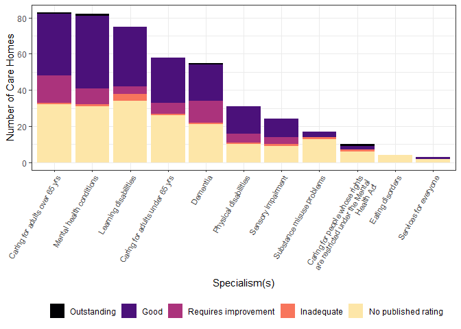

<!-- README.md is generated from README.Rmd. Please edit that file -->

# cqcr

<!-- badges: start -->

[](https://www.gnu.org/licenses/gpl-3.0)
[](https://cran.r-project.org/package=cqcr)
[](https://github.com/evanodell/cqcr)
[](https://dgrtwo.shinyapps.io/cranview/)
[](https://github.com/evanodell/cqcr/actions)
[](https://ci.appveyor.com/project/evanodell/cqcr)
[](https://codecov.io/gh/evanodell/cqcr?branch=master)
[](https://zenodo.org/badge/latestdoi/204009825)
<!-- badges: end -->

Get data from the Care Quality Commission
[API](https://anypoint.mulesoft.com/exchange/portals/care-quality-commission-5/4d36bd23-127d-4acf-8903-ba292ea615d4/cqc-syndication-1/)

Access data from the ‘Care Quality Commission’, the health and adult
social care regulator for England. The ‘Care Quality Commission’
operates an
[API](https://www.cqc.org.uk/about-us/transparency/using-cqc-data#api),
with data available under the Open Government License. Data includes
information on service providers, locations such as hospitals, care
homes and medical clinics, and ratings and inspection reports.

## Installation

The package is available on
[CRAN](https://cran.r-project.org/package=cqcr), and can be installed
with:

    install.packages("cqcr")

To install the development version from GitHub use:

    #install.packages("devtools")
    devtools::install_github("evanodell/cqcr")

``` r
library(cqcr)
library(purrr)
library(dplyr)
#> 
#> Attaching package: 'dplyr'
#> The following objects are masked from 'package:stats':
#> 
#>     filter, lag
#> The following objects are masked from 'package:base':
#> 
#>     intersect, setdiff, setequal, union
library(ggplot2)
library(forcats)
```

``` r
loc1 <- cqc_locations_search(care_home = TRUE, 
                             local_authority = c("Waltham Forest",
                                                 "Hackney", "Tower Hamlets"))


care_home_details <- cqc_location_details(loc1)

care_home_df <- map_dfr(care_home_details, `[`,
                        c("location_id", "name", "number_of_beds", 
                          "onspd_longitude", "onspd_latitude"))

care_home_df <- care_home_df %>% 
  mutate(rating = care_home_details %>%
           map(c("current_ratings", "overall", "rating")) %>%
           as.character(),
         rating = recode(rating, "NULL" = "No published rating"),
         rating = factor(rating, levels = c("Outstanding", "Good",
                                            "Requires improvement", 
                                            "Inadequate",
                                            "No published rating")),
         report_date = care_home_details %>%
           map(c("current_ratings", "reportDate")) %>%
           as.character(),
         report_date = ifelse(report_date == "NULL", NA, report_date),
         specialisms = care_home_details %>% map(c("specialisms", "name")))
```

``` r
care_home_df_unnest <- tidyr::unnest(care_home_df, cols = c(specialisms)) %>%
  mutate(specialisms = fct_infreq(specialisms))

theme_set(theme_bw())

ggplot(care_home_df_unnest,
                        aes(x = specialisms, fill = rating)) + 
  geom_bar() + 
  scale_x_discrete(labels = scales::wrap_format(33)) + 
  scale_fill_viridis_d(name="", option = "A", end = 0.95) + 
  labs(x = "Specialism(s)", y = "Number of Care Homes") + 
  theme(legend.position = "bottom",
        axis.text.x = element_text(size = 8, angle = 60, hjust = 1))
```



# Citing cqcr

Odell E (2019). *cqcr: Access ‘Care Quality Commission’ Data*. doi:
10.5281/zenodo.3452020, R package version 0.1.3.9000, URL:
<https://github.com/evanodell/cqcr>.

A BibTeX entry for LaTeX users is

      @Manual{,
        title = {{cqcr}: Access 'Care Quality Commission' Data},
        author = {Evan Odell},
        doi = {10.5281/zenodo.3452020},
        year = {2019},
        note = {R package version 0.1.3.9000},
        url = {https://github.com/evanodell/cqcr},
      }

# Notes

This package is not affiliated with or supported by the Care Quality
Commission.

Please note that the ‘cqcr’ project is released with a [Contributor Code
of
Conduct](https://github.com/evanodell/cqcr/blob/master/CODE_OF_CONDUCT.md).
By contributing to this project, you agree to abide by its terms.
